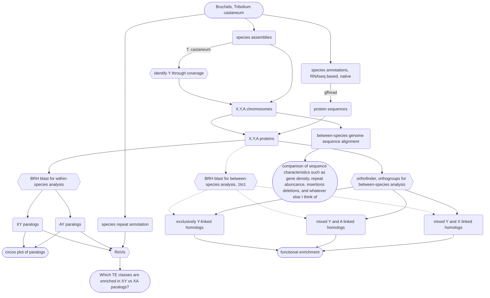

# PhD chapter II
Gene traffic to and from the sex chromosomes in coleoptera

# Reading

* (Review)[Ellegren 2011](https://www.nature.com/articles/nrg2948.pdf) review on the influence of heterogameity on sex chromosome evolution
  * *"For example, long interspersed repeat elements are enriched on both the mammalian X and the avian Z chromosome \[46,47\], whereas gene  density is lower than on autosomes in both systems as a result of intergenic expansions \[27,48\]"*
  * He also says about the selection pressure on X-linked genes in the heterogametic sex that *selection will occur more frequently* as opposed to that it is stronger, which I think doesn't change the outcome because the selection is stronger in the end compared to the autosomes due to it occuring more frequently
  * *Among the genes that generate new retrocopies, through mRNA intermediates, there is an excess of X-linked genes inserted at autosomal locations.* Might be because X linked genes are temporarily inactivated during meiosis in males (meiotic sex-chromosome inactivation **MSCI**), and genes that give selective advantage to males want to escape. The retrocopies that leave often aquire male-specific function, because, if dominant, they spread easier on the autosomes because they are temporarily inactivated on the X negating their selective advantage
  * References about Gene traffic to and from the X chromosome
    * Emerson, J. J., Kaessmann, H., Betran, E. & Long, M. Extensive gene traffic on the mammalian X chromosome. Science 303, 537–540 (2004)
    * Shiao, M. S. et al. Origins of new male germ-line functions from X-derived autosomal retrogenes in the mouse. Mol. Biol. Evol. 24, 2242–2253 (2007).
    * Vinckenbosch, N., Dupanloup, I. & Kaessmann, H. Evolutionary fate of retroposed gene copies in the human genome. Proc. Natl Acad. Sci.USA 103, 3220–3225 (2006).
    * Meisel, R. P., Han, M. V. & Hahn, M. W. A complex suite of forces drives gene traffic from Drosophila X chromosomes. Genome Biol. Evol. 1, 176–188 (2009).
    * Vibranovski, M. D., Zhang, Y. & Long, M. General gene movement off the X chromosome in the Drosophila genus. Genome Res. 19, 897–903
  (2009)
* [Yu 2026](https://www.pnas.org/doi/full/10.1073/pnas.2522417123) super conserved noncoding sex determining locus in (haplodiploid) hymenoptera

## workflow pipeline

Maybe old TODO double check

<details>
<summary>Flowchart</summary>



</details>

# synteny

I will start with a synteny analysis of the four bruchid species in this analysis and *Tribolium castaneum* as an outgroup. I will do it the same way as Höök & Näsvall [here](https://doi.org/10.1007/s10577-023-09713-z) with protein synteny via MCScanX and visualization with [SynVisio](https://synvisio.github.io/#/).

## samples

I am using the superscaffolded version of Cmac for now to get a better idea of the big picture. However, since the superscaffolding does not work well for the Y chromosome and just fragments it more, I will use the Kaufmann2023 assembly and annotation for the detailed X and Y chromosome related analyses. The annotation is not ideal in some aspect, since it estimates a very high number of genes and has a high proportion of single exon genes which I hypothesize are caused by some default values in the BRAKER2 and TSEBRA pipeline being not ideal for these kinds of large beetle genomes. I have attempted to reannotate the assembly with BRAKER3 and the same population-specific RNAseq data as the original annotation (see `bash/reannotate_Kaufmann2023.sh`), but this struggles to identify the TOR copy number variation on the Y chromosome (in a way that it does not when RNAseq data is excluded), therefore I have decided to continue using the Kaufmann 2023 version of the annotation. See detailed report on me figuring it out in [chapter 4](https://github.com/milena-t/PhD_chapter4/blob/main/mTOR_annotation/mTOR_notes.md), especially the figure at the end.

### sex chromosome identification

* **Bruchids**
  * *C. maculatus:* from Kaufmann et al.: 
    ```python
    { X : ['utg000057l_1','utg000114l_1','utg000139l_1','utg000191l_1','utg000326l_1','utg000359l_1','utg000532l_1','utg000602l_1'],
      Y : ['utg000322l_1','utg 000312c_1','utg 000610l_1','utg 001235l_1']}
    ``` 
  
  * *C. chinensis:*
    identified by me, but the assembly is very fragmented so there is a lot of contigs.

    ```python
    { X : ["1211_quiver","1844_quiver","854_quiver","5741_quiver","2866_quiver","658_quiver","1498_quiver","1455_quiver","2404_quiver","2935_quiver","1115_quiver","370_quiver","2273_quiver","1424_quiver","1865_quiver","767_quiver","2222_quiver","1525_quiver","5023_quiver","1925_quiver","1217_quiver","2328_quiver","2475_quiver","959_quiver","537_quiver","2776_quiver","325_quiver","2576_quiver","2336_quiver","988_quiver","2252_quiver","1388_quiver","1508_quiver","1712_quiver","1260_quiver","977_quiver","2202_quiver","2223_quiver","2397_quiver","693_quiver","1092_quiver","2189_quiver","1958_quiver","1355_quiver","2241_quiver","849_quiver","703_quiver","277_quiver","518_quiver","2589_quiver","1326_quiver","2962_quiver","2341_quiver","358_quiver","462_quiver","2786_quiver","1116_quiver","525_quiver","1358_quiver","5693_quiver","1429_quiver","1253_quiver","2372_quiver","326_quiver","474_quiver","777_quiver","955_quiver","1852_quiver","718_quiver","1024_quiver","1974_quiver","2295_quiver","2356_quiver","1484_quiver","1503_quiver","3076_quiver","2091_quiver","1262_quiver","1109_quiver","1475_quiver","1695_quiver","1168_quiver","1386_quiver","2201_quiver","2320_quiver","1117_quiver","769_quiver","2050_quiver","1805_quiver","2692_quiver","411_quiver","851_quiver","5703_quiver","1585_quiver","824_quiver","1816_quiver","1370_quiver","2416_quiver","1814_quiver","1277_quiver","619_quiver","1750_quiver","2709_quiver","2664_quiver","1250_quiver","971_quiver","3020_quiver","310_quiver","1176_quiver","2510_quiver","1699_quiver","1256_quiver","1420_quiver","5727_quiver","413_quiver","1124_quiver","682_quiver","1000_quiver","1313_quiver","5708_quiver","1556_quiver","274_quiver","1787_quiver","1137_quiver","360_quiver","1469_quiver","1853_quiver","2380_quiver","1239_quiver","993_quiver","791_quiver","2540_quiver","1510_quiver","868_quiver","505_quiver","1212_quiver","376_quiver","1564_quiver","1836_quiver","1670_quiver","500_quiver","2099_quiver","353_quiver","1042_quiver","419_quiver","1314_quiver","1339_quiver","1470_quiver","1576_quiver","1717_quiver","5692_quiver","2157_quiver","700_quiver","1284_quiver","1694_quiver","2306_quiver","2712_quiver","182_quiver","1973_quiver","882_quiver","2363_quiver","2482_quiver","1640_quiver","1913_quiver","2323_quiver","1240_quiver","161_quiver","1649_quiver","1164_quiver","1054_quiver","1096_quiver","313_quiver","1815_quiver","1831_quiver","1349_quiver","151_quiver","1478_quiver","1523_quiver","1888_quiver","739_quiver","1322_quiver","2338_quiver","1798_quiver","1391_quiver","1530_quiver","1519_quiver","1651_quiver","1105_quiver","509_quiver","1308_quiver","1833_quiver","1914_quiver","1741_quiver","1080_quiver","2292_quiver","2364_quiver","643_quiver","5745_quiver","1920_quiver","1725_quiver","125_quiver","1086_quiver","2552_quiver","5749_quiver","2120_quiver","2964_quiver","5722_quiver","2045_quiver","2422_quiver","593_quiver","1496_quiver","1772_quiver","799_quiver","2690_quiver","414_quiver","1531_quiver","1443_quiver","1408_quiver","1688_quiver","1371_quiver","1501_quiver","3090_quiver","1025_quiver","5698_quiver","347_quiver","1435_quiver","476_quiver","1883_quiver","2820_quiver","5728_quiver","342_quiver","1972_quiver","1826_quiver","968_quiver","2037_quiver","1723_quiver","252_quiver","1863_quiver","2983_quiver","1947_quiver","1430_quiver","1612_quiver","1701_quiver","839_quiver","613_quiver","1979_quiver","1584_quiver","2024_quiver","1486_quiver","1097_quiver"],
      Y : ["850_quiver","949_quiver","1088_quiver","1125_quiver","1159_quiver","1134_quiver","1224_quiver","1369_quiver","1410_quiver","1568_quiver","1577_quiver","1619_quiver","1634_quiver","1646_quiver","1652_quiver","1665_quiver","1681_quiver","1697_quiver","1722_quiver","1766_quiver","1783_quiver","1891_quiver","1937_quiver","1963_quiver","1790_quiver","1997_quiver","2073_quiver","2113_quiver","2163_quiver","2166_quiver","5705_quiver","2245_quiver","2259_quiver","2260_quiver","2334_quiver","2340_quiver","2382_quiver","2443_quiver","2511_quiver","2534_quiver","2573_quiver","2597_quiver","2651_quiver","2707_quiver","2766_quiver","2773_quiver","2791_quiver","2830_quiver","2875_quiver","3022_quiver","3070_quiver","3074_quiver","3075_quiver","3078_quiver"]}
    ```
  * *B. siliquastri* identified by the DTOL project with the assembly
    ```python
    { X : ['X'],
      Y : ['Y']}
    ``` 
  * *A. obtectus* Identified by me and Göran's project about it
    ```python
    { X : ['CAVLJG010000002.1'],
      Y : ['scaffold_13', 'scaffold_86']} # some have HiC and some don't but that may just be manual renaming of the largest to chromosomes
    ``` 


### Testing if linkage group 11 in tribolium is the Y chromosome

I will be using the pool seq data from [Cheng 2024](https://www.nature.com/articles/s41559-023-02246-y#Sec8), BioProject PRJNA942224. There are 6 pools of 100 eggs, which means the sexes are mixed, but it is likely enough individuals that we can approximate a 50/50 sex ratio overall. I download them to uppmax with the help of [this tutorial](https://bioinformaticsworkbook.org/dataAcquisition/fileTransfer/sra.html#gsc.tab=0) 
I will trim with fastp, map with bwa-mem, deduplicate with [picard](https://broadinstitute.github.io/picard/), and then use samtools to analyze the coverage. 

I conclude here that this is NOT the Y chromosome, the coverage really gives no indication.


## MCScanX

[MCScanX](https://github.com/wyp1125/MCScanX) is based on protein synteny from blastp searches. The documentation is not super useful beyond the installation instructions, so I was recommended [this workflow](https://www.nature.com/articles/s41596-024-00968-2#Sec29), which I will use for detailed instructions, but for preparing the input files, I am using my own scripts and not their provided ones (esp. the perl scripts have hard-coded aspects that assume ncbi assemblies and annotations, which doesn't apply to my data). MCScanX only takes one input: the prefix of both files below. It says directory in the documentation but that's wrong. You run from the same directory as the files are in and the command is just `./MCScanX prefix` where the input files are `prefix.gff` `prefix.blast` in the same directory.

* **`prefix.gff`:** I used my script `src/make_bedfile_for_MCScanX.py` which makes all the files according to the format required, including reformatting the contig names, and also creating a lookup table to associate the new contig names with the original ones from the annotations. The files are then all merged with `cat *.bed > prefix.gff`
* **`prefix.blast`:** I am using blastp according to the above cited workflow on all the species `bash/blastp_for_synteny.sh`. All blast results are again merged `cat *.blast > prefix.blast`.

### Troubleshooting

* **no alighments generated:** The log file reads no blast alignments. For me, this was caused by the file extension of the annotation file. I named it `.bed` but it should be `.gff` (because it is somehow hardcoded and there is no test to see if a file actually exists?)

## Results plotted with SynVisio

I have visualized the results with [SynVisio](https://synvisio.github.io/#/).
The order in the species in the below plot from top to bottom is:

* *Callosobruchus maculatus* (cm)
* *Acanthoscelides obtectus* (ao)
* *Bruchidius siliquastri* (bs)
* *Tribolium castaneum* (tc)
  
All species have the same karyotype: 9 autosomal pairs + XY. *C. chinensis* was included in the analysis but not the plot because the assembly is so fragmented it is not helpful to visualize here.


The sex chromosomes are these (chromosomes with no syntenic regions are excluded from the plot)

* ***B. siliquastri***: X: `bs9`, Y: `bs8`
  
TODO others, see chapter 4

* ***A. obtectus***:
* ***C. maculatus***:
* ***T. castaneum***:

see the [alternative synteny plot](data/images/synvisio_plot.png) for a different order of the bruchid species. Their tree topology is `((Cmac,Bsil),Aobt)`, but there is a bunch of rearrangements between all of them, and *C. maculatus* is not visibly more similar to *B. siliquastri* than to *A. obtectus*.


# Whole genome alignments

There are two approaches I try:

* nucmer (part of [mummer](https://github.com/mummer4/mummer)) which does pairwise whole genome alignments. There is some filtering after the fact, and the Backström group has a script to identify breakpoints based on the many short alignments returned by mummer. 
* Cactus (specifically [progressive cactus](https://github.com/ComparativeGenomicsToolkit/cactus/blob/master/doc/progressive.md)) which is the more modern alternative that can do multiple genome alignments.

## Mummer

Going a bit slow because I am trying it on pelle for the first time.

## Cactus

Cactus also requires a tree, I will use the one from orthofinder. 
```
((D_carinulata_assembly.fna:0.0134181,D_sublienata_assembly.fna:0.0125413)N1:0.207728,((B_siliquastri_assembly.fna:0.0970413,(C_chinensis_assembly.fna:0.0861114,C_maculatus_superscaffolded_assembly.fna:0.0473365)N4:0.0397501)N3:0.0316001,A_obtectus_assembly.fna:0.109523)N2:0.207728)N0;
```

# Translocation analysis

I aim to investigate the processes by which the genes migrate to the sex chromosomes resulting in the patterns we observe today. Orthologs, including gametologs, are identified with orthofinder between all species, and with the help of the known phylogeny I will trace back when and how genes on the Y chromosome originated.

## Retrotransposition

try this tool: [RetroScan](https://www.frontiersin.org/journals/genetics/articles/10.3389/fgene.2021.719204/full)

## notes


* [Peneder 2017](https://onlinelibrary.wiley.com/doi/full/10.1002/ece3.3278): Exchange of genetic information between therian X and Y chromosome gametologs in old evolutionary strata
* [Martinez-Pacheco 2020](https://academic.oup.com/gbe/article/12/11/2015/5892261) 
  * double check y linked gene presence by `blastn` against the assembly.
  * *"the best BlastN match (usually around 92–95% identity over the entire sequence) onto the annotated X chromosome of the reference genomes was considered the X gametologs"*
  * If the X gametolog is missing in the annotation, the sequene from the transcriptome was used instead
* [Bissegger 2019](https://onlinelibrary.wiley.com/doi/full/10.1111/mec.15255) A genes copied onto the Y impact the detection of between-sex F_ST and intralocus sexual conflict, with additional commentary by [Mank et al](https://onlinelibrary.wiley.com/doi/full/10.1111/mec.15311).

### Reviews

* [Tosto 2023](https://www.nature.com/articles/s41559-023-02019-7?fromPaywallRec=false) The roles of sexual selection and sexual conflict in shaping patterns of genome and transcriptome variation
* [Mank 2023](https://www.nature.com/articles/s41576-022-00524-2) Sex-specific morphs: the genetics and evolution of intra-sexual variation
* [Schenkel 2018](https://onlinelibrary.wiley.com/doi/full/10.1002/ece3.4629) Making sense of intralocus and interlocus sexual conflict 
  * translocations to sex chromosomes to escape conflict

## orthofinder results
