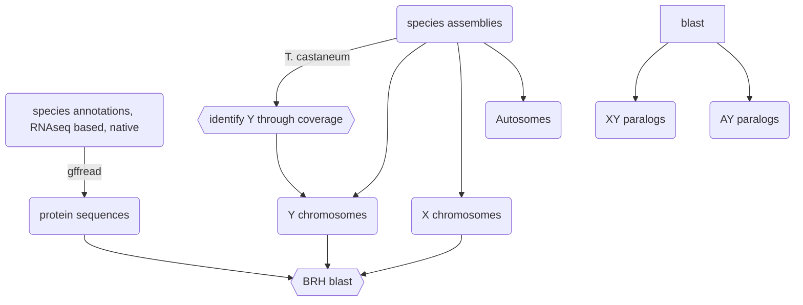

# PhD chapter II
Gene traffic to and from the sex chromosomes in coleoptera

## workflow pipeline

<details>
<summary>Flowchart</summary>



</details>

# synteny

I will start with a synteny analysis of the four bruchid species in this analysis and *Tribolium castaneum* as an outgroup. I will do it the same way as Höök & Näsvall [here](https://doi.org/10.1007/s10577-023-09713-z) with protein synteny via MCScanX and visualization with [SynVisio](https://synvisio.github.io/#/).

## samples

I am using the superscaffolded version of Cmac for now to get a better idea of the big picture. However, since the superscaffolding does not work well for the Y chromosome and just fragments it more, I will use the Kaufmann2023 assembly and annotation for the detailed X and Y chromosome related analyses. The annotation is not ideal in some aspect, since it estimates a very high number of genes and has a high proportion of single exon genes which I hypothesize are caused by some default values in the BRAKER2 and TSEBRA pipeline being not ideal for these kinds of large beetle genomes. I have attempted to reannotate the assembly with BRAKER3 and the same population-specific RNAseq data as the original annotation (see `bash/reannotate_Kaufmann2023.sh`), but this struggles to identify the TOR copy number variation on the Y chromosome (in a way that it does not when RNAseq data is excluded), therefore I have decided to continue using the Kaufmann 2023 version of the annotation. See detailed report on me figuring it out in [chapter 4](https://github.com/milena-t/PhD_chapter4/blob/main/mTOR_annotation/mTOR_notes.md), especially the figure at the end.

### sex chromosome identification

* **Bruchids**
  * *C. maculatus:* from Kaufmann et al.: 
    ```python
    { X : ['utg000057l_1','utg000114l_1','utg000139l_1','utg000191l_1','utg000326l_1','utg000359l_1','utg000532l_1','utg000602l_1'],
      Y : ['utg000322l_1','utg 000312c_1','utg 000610l_1','utg 001235l_1']}
    ``` 
  
  * *C. chinensis:*
    identified by me, but the assembly is very fragmented so there is a lot of contigs.

    ```python
    { X : ["1092_quiver","1124_quiver","1080_quiver","1105_quiver","1148_quiver","1339_quiver","1435_quiver","1482_quiver","1501_quiver","1565_quiver","1694_quiver","1688_quiver","1758_quiver","1618_quiver","1786_quiver","1816_quiver","1815_quiver","1817_quiver","1826_quiver","1889_quiver","1898_quiver","1908_quiver","1911_quiver","1933_quiver","2046_quiver","2054_quiver","2056_quiver","5713_quiver","2194_quiver","2226_quiver","2306_quiver","2357_quiver","2381_quiver","2392_quiver","2400_quiver","2435_quiver","2453_quiver","2513_quiver","2524_quiver","2569_quiver","2576_quiver","2580_quiver","2599_quiver","2693_quiver","2733_quiver","1210_quiver","2935_quiver","2958_quiver","2964_quiver","3034_quiver","3068_quiver","3080_quiver","3091_quiver"],
      Y : ["850_quiver","949_quiver","1088_quiver","1125_quiver","1159_quiver","1134_quiver","1224_quiver","1369_quiver","1410_quiver","1568_quiver","1577_quiver","1619_quiver","1634_quiver","1646_quiver","1652_quiver","1665_quiver","1681_quiver","1697_quiver","1722_quiver","1766_quiver","1783_quiver","1891_quiver","1937_quiver","1963_quiver","1790_quiver","1997_quiver","2073_quiver","2113_quiver","2163_quiver","2166_quiver","5705_quiver","2245_quiver","2259_quiver","2260_quiver","2334_quiver","2340_quiver","2382_quiver","2443_quiver","2511_quiver","2534_quiver","2573_quiver","2597_quiver","2651_quiver","2707_quiver","2766_quiver","2773_quiver","2791_quiver","2830_quiver","2875_quiver","3022_quiver","3070_quiver","3074_quiver","3075_quiver","3078_quiver"]}
    ```
  * *B. siliquastri* identified by the DTOL project with the assembly
    ```python
    { X : ['X'],
      Y : ['Y']}
    ``` 
  * *A. obtectus* Identified by me and Göran's project about it
    ```python
    { X : ['CAVLJG010000002.1'], # ["HiC_scaffold_10", 'scaffold_21'] # double check assembly versions for correct scaffold names, i also have 'Chr_10' as a name
      Y : ['scaffold_13', 'scaffold_86']} # some have HiC and some don't but that may just be manual renaming of the largest to chromosomes
    ``` 
* **Cochinella**
  * *C. septempunctata*
    ```python
    { X : ["NC_058198.1"],
      Y : []} # there's no Y linkage group but MT is OU015583.1
    ``` 
  * *C. magnifica*
    ```python
    { X : ['OZ286750.1'],
      Y : []} # there's no Y linkage group identified but MT is OZ286751.1
    ``` 
* **Tribolium**
  
  In [Whittle 2020](https://academic.oup.com/g3journal/article/10/3/1125/6026234) the Y chromosome in *T. castaneum* was not included because "*\[it\] is small (<5MB), highly degenerate, contains few if any protein-coding genes, and is not included in the genetic linkage map; accordingly it was not studied*". Unsure how I am going to identify them, maybe I can find some WGS illumina data to do SATC?
  * *T. castaneum*
    ```python
    { X : ["NC_087403.1"], # linkage grounp 10
      Y : []} # there is a linkage grounp 11 (NC_087404.1) and in the RefSeq sequence there's a MT linkage group NC_003081.2
    ``` 
  * *T. freemani*
    ```python
    { X : ['ENA_CM039461_CM039461.1_Tribolium_freemani_isolate_YK'], # according to NCBI this is linkage group X
      Y : []}
    ``` 

### Verifying that linkage group 11 in tribolium is the Y chromosome

I will be using the pool seq data from [Cheng 2024](https://www.nature.com/articles/s41559-023-02246-y#Sec8), BioProject PRJNA942224. There are 6 pools of 100 eggs, which means the sexes are mixed, but it is likely enough individuals that we can approximate a 50/50 sex ratio overall. I download them to uppmax with the help of [this tutorial](https://bioinformaticsworkbook.org/dataAcquisition/fileTransfer/sra.html#gsc.tab=0) 
I will trim with fastp, map with bwa-mem, deduplicate with [picard](https://broadinstitute.github.io/picard/), and then use samtools to analyze the coverage. 


## MCScanX

[MCScanX](https://github.com/wyp1125/MCScanX) is based on protein synteny from blastp searches. The documentation is not super useful beyond the installation instructions, so I was recommended [this workflow](https://www.nature.com/articles/s41596-024-00968-2#Sec29), which I will use for detailed instructions, but for preparing the input files, I am using my own scripts and not their provided ones (esp. the perl scripts have hard-coded aspects that assume ncbi assemblies and annotations, which doesn't apply to my data). MCScanX only takes one input: the prefix of both files below. It says directory in the documentation but that's wrong. You run from the same directory as the files are in and the command is just `./MCScanX prefix` where the input files are `prefix.gff` `prefix.blast` in the same directory.

* **`prefix.gff`:** I used my script `src/make_bedfile_for_MCScanX.py` which makes all the files according to the format required, including reformatting the contig names, and also creating a lookup table to associate the new contig names with the original ones from the annotations. The files are then all merged with `cat *.bed > prefix.gff`
* **`prefix.blast`:** I am using blastp according to the above cited workflow on all the species `bash/blastp_for_synteny.sh`. All blast results are again merged `cat *.blast > prefix.blast`.

### Troubleshooting

* **no alighments generated:** The log file reads no blast alignments. For me, this was caused by the file extension of the annotation file. I named it `.bed` but it should be `.gff` (because it is somehow hardcoded and there is no test to see if a file actually exists?)

## Results plotted with SynVisio

I have visualized the results with [SynVisio](https://synvisio.github.io/#/).
The order in the species in the below plot from top to bottom is:

* *Callosobruchus maculatus* (cm)
* *Acanthoscelides obtectus* (ao)
* *Bruchidius siliquastri* (bs)
* *Tribolium castaneum* (tc)
  
All species have the same karyotype: 9 autosomal pairs + XY. *C. chinensis* was included in the analysis but not the plot because the assembly is so fragmented it is not helpful to visualize here.


The sex chromosomes are these (chromosomes with no syntenic regions are excluded from the plot)

* ***B. siliquastri***: X: `bs9`, Y: `bs8`
  
TODO others

* ***A. obtectus***:
* ***C. maculatus***:
* ***T. castaneum***:

see the [alternative synteny plot](data/images/synvisio_plot.png) for a different order of the bruchid species. Their tree topology is `((Cmac,Bsil),Aobt)`, but there is a bunch of rearrangements between all of them, and *C. maculatus* is not visibly more similar to *B. siliquastri* than to *A. obtectus*.

# Translocation analysis

I aim to investigate the processes by which the genes migrate to the sex chromosomes resulting in the patterns we observe today. Orthologs, including gametologs, are identified with orthofinder between all species, and with the help of the known phylogeny I will trace back when and how genes on the Y chromosome originated.

## notes


* [Peneder 2017](https://onlinelibrary.wiley.com/doi/full/10.1002/ece3.3278): Exchange of genetic information between therian X and Y chromosome gametologs in old evolutionary strata
* [Martinez-Pacheco 2020](https://academic.oup.com/gbe/article/12/11/2015/5892261) 
  * double check y linked gene presence by `blastn` against the assembly.
  * *"the best BlastN match (usually around 92–95% identity over the entire sequence) onto the annotated X chromosome of the reference genomes was considered the X gametologs"*
  * If the X gametolog is missing in the annotation, the sequene from the transcriptome was used instead

## orthofinder results
